# Gitsune design references

The Mobbin-sourced mobile design research behind Gitsune's seven surfaces, with GitLab's Pajamas design system as the visual-language bar.
Approved as a design-research snapshot on 2026-08-01.
Source research: the gitlab-mobile design scout report (2026-08-01); screenshots in `references/` were resolved from Mobbin's public preview CDN; five references expose no public image and remain citation links.

**Amended:** the blue interactive-color guidance below is superseded by `docs/decisions/0007-interactive-color-orange-over-blue.md`, and the dual-theme v1 guidance is superseded by `docs/decisions/0008-dark-mode-only-v1.md`.
The reference observations remain as written because they document the phase-one evidence, while those ADRs own Gitsune's current decisions.

**The one-line rule: GitHub Mobile decides how it moves; Pajamas decides how it looks, speaks, and what things are called.**

## The Pajamas foundation kit

All open source, all public, all repo-shippable.

- **[Color](https://design.gitlab.com/product-foundations/color):** five semantic ramps of 11 steps - blue = current/active/progress, green = success/done/approved, orange = warning/pending, red = critical/failed/destructive, purple = brand (illustrations and empty states, never the interactive color) - plus neutrals 0-1000.
  Interactive states darken one step on hover/focus, two on active. All WCAG AA.
  The semantic mapping IS the identity: pipeline passed is green, running blue, failed red, pending orange, everywhere, with no decorative reassignment.
- **[Type](https://design.gitlab.com/product-foundations/type-fundamentals):** GitLab Sans (Inter-based) for UI, GitLab Mono (JetBrains-based) for code, branch names, commit IDs, and pipeline IDs.
  Two weights carry everything: 400 body, 600 headings. Ship both faces in the app.
  Monospace-for-every-git-ref is a hard token-level rule. Pajamas line heights are TODO upstream, so mobile line heights are ours to set.
- **[Iconography](https://design.gitlab.com/product-foundations/iconography):** GitLab SVGs as the only glyph source, including the pipeline-status set.
  1.5px strokes, rounded caps, color-inheriting. One sanctioned deviation: render at 20-24px inside 44pt touch targets.
- **[Components](https://design.gitlab.com/components/overview):** use the Pajamas names - Alert, Toast, Badge, Label, Token, Card, Drawer, Modal, Tabs, Skeleton, Avatar - never "chips" or "tags".
- **[Voice](https://design.gitlab.com/brand-messaging/brand-voice/):** plain and quiet - "Merge request merged", "Pipeline failed" - no exclamation-mark celebration.
- **Terminology is design:** Merge Request never PR, Pipeline never Checks, To-Do List, Project and Group, Approvals.

## Surface 1 - Sign-in and instance entry (differentiator, design first)

*Bluesky: Sign-in with a "Hosting provider" field above the account fields - the shape to steal* - [canonical](https://mobbin.com/screens/d9396132-fa25-49a5-abc9-fe0a5968bf96)

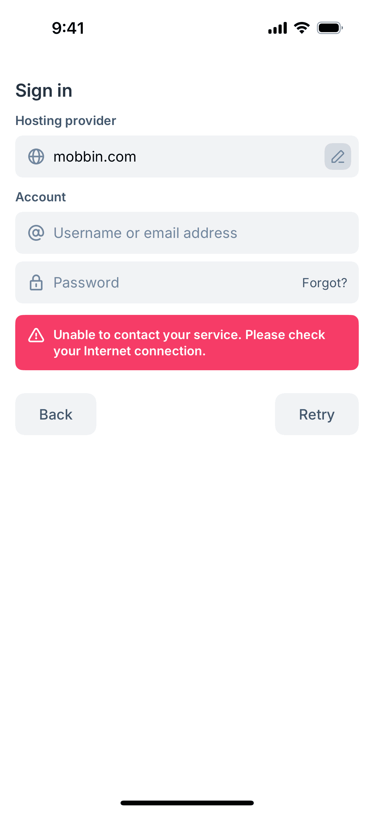
*Bluesky: Its honest failure state: "Unable to contact your service"* - [canonical](https://mobbin.com/screens/76987c00-2bd3-4966-a632-b1a689bf834d)

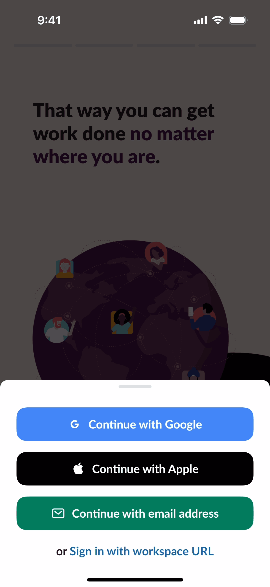
*Slack: "Sign in with workspace URL" as a buried text link - the anti-pattern* - [canonical](https://mobbin.com/screens/b7b5c43b-4a26-4deb-96b3-a7def8aa48ce)

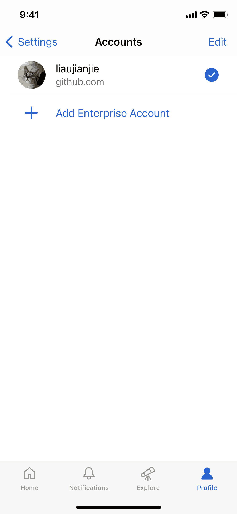
*GitHub: "Add Enterprise Account" hidden in settings - the other anti-pattern* - [canonical](https://mobbin.com/screens/5d3a1ed0-a1b4-4999-892e-e302bc5580a5)

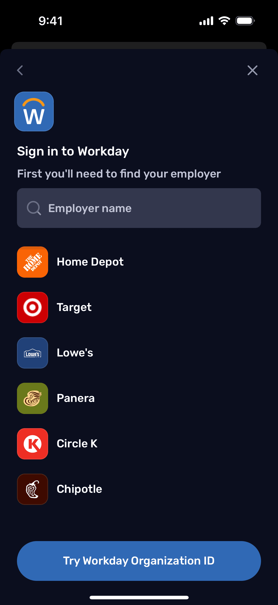
*Workday One: Search-first "find your employer" - does not fit (no directory of instances exists)* - [canonical](https://mobbin.com/screens/b9c2f935-3abf-48ea-ae42-38bc2da21690)

**Recommended shape:** Bluesky's, not Slack's or GitHub's. A "GitLab instance" field shown permanently, pre-filled `gitlab.com`, visibly editable, with one continue action below and no credential fields on the primary screen. An unreachable or non-GitLab URL gets an inline red Alert, never a silent hang. The locked auth ruling slots in here: one-tap OAuth on gitlab.com, the guided wizard for self-hosted, and the PAT fallback behind a secondary affordance.

**Pajamas notes:** neutral-0 surface, GitLab Sans, one blue confirm button, purple reserved for the logo and illustration.

## Surface 2 - Home and navigation

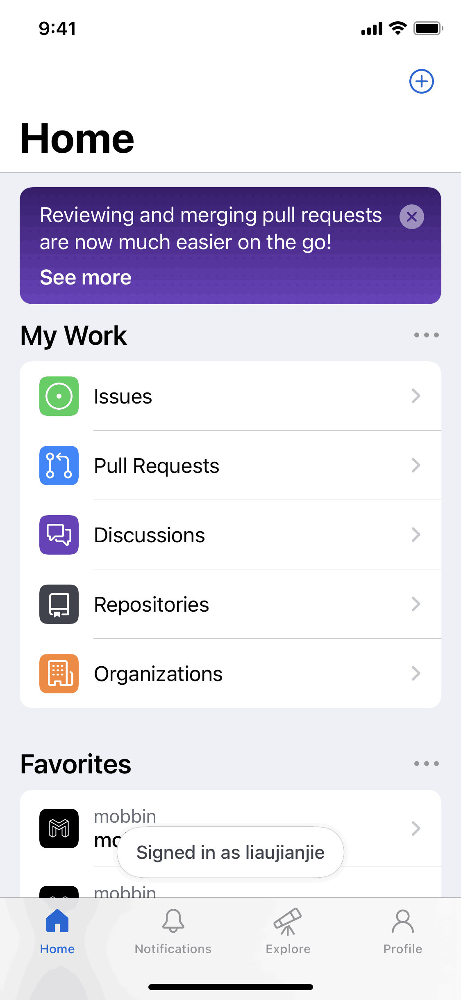
*GitHub: Home: "My Work" colored tiles, Favorites, Recent - light* - [canonical](https://mobbin.com/screens/dfd5799c-6eda-4120-9cbc-eef758ebf26a)

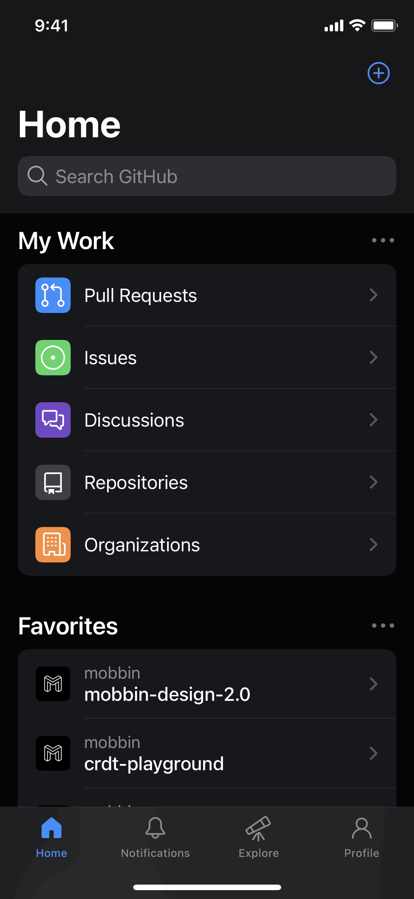
*GitHub: The same Home in dark - design both themes together* - [canonical](https://mobbin.com/screens/24b3cdbf-d26e-4908-8b30-2c5bcb593088)

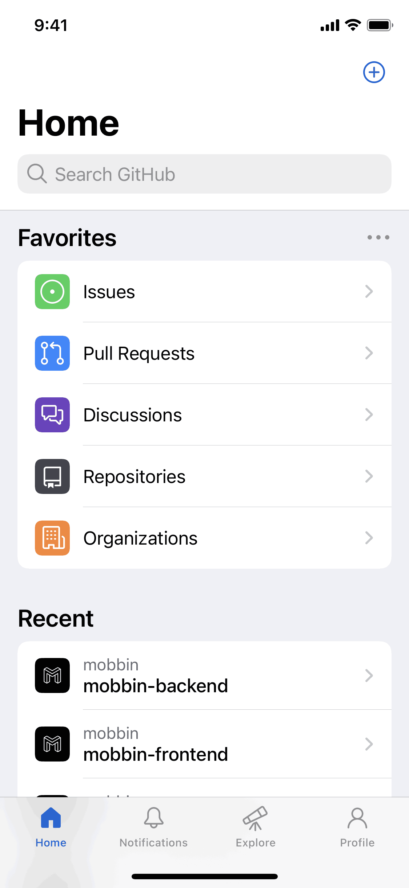
*GitHub: The same Home in dark - design both themes together* - [canonical](https://mobbin.com/screens/9be4aad3-c5b8-41a3-adc5-d60a940edccb)

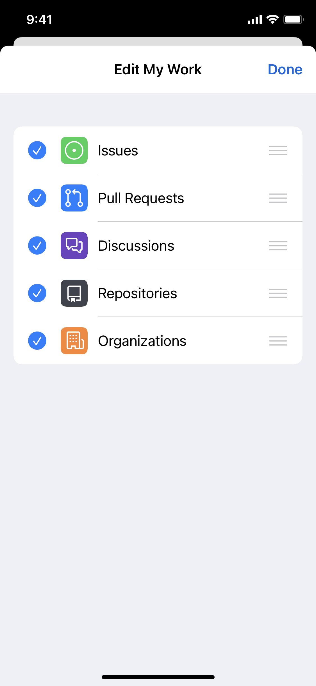
*GitHub: "Edit My Work" reorder sheet - checkboxes plus drag handles* - [canonical](https://mobbin.com/screens/fca69407-4df2-4d2c-a90f-83f70bd13671)

- **GitHub** - Repository detail flow: counts list, monospace branch chip, Browse code, inline README: [reference](https://mobbin.com/flows/def7a90e-2606-4c80-92a0-d34c8ce78fff) *(citation-only: no public image)*

**Recommended shape:** adopt GitHub's Home wholesale. Tiles mapped to GitLab nouns: Issues, Merge Requests, To-Do List, Pipelines, Projects, Groups; keep the reorderable sheet. Project detail mirrors repository detail. Bottom tabs: Home, To-Dos, Explore/Search, Profile.

**Pajamas notes:** tile containers colored from the ramps (issues green, MRs blue, to-dos orange, pipelines purple-or-blue), glyphs from GitLab SVGs, branch chips in GitLab Mono. With two instances signed in, Home carries a compact host indicator.

## Surface 3 - Issue view

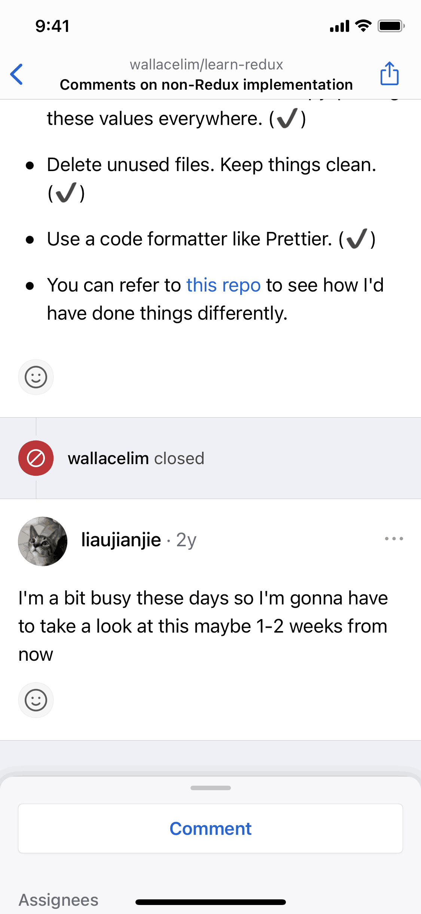
*GitHub: Thread with state-change events inline and reactions* - [canonical](https://mobbin.com/screens/d8e6f226-e5fe-47d6-884c-7fa41d7d4e5a)

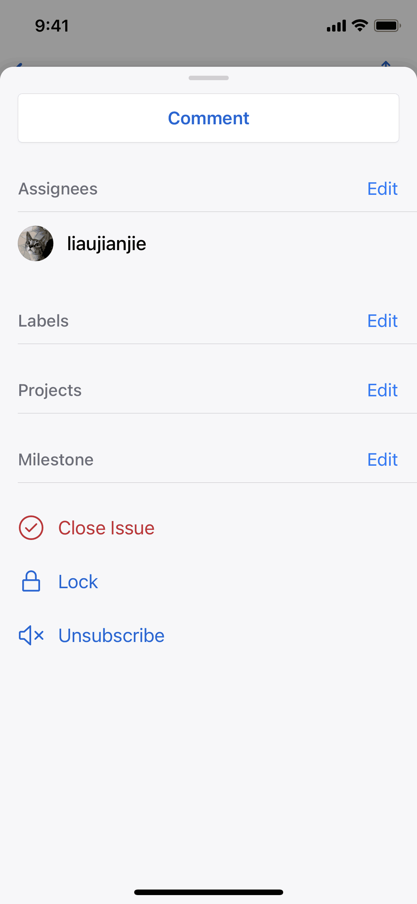
*GitHub: Actions bottom sheet: Assignees / Labels / Milestone, then the destructive zone* - [canonical](https://mobbin.com/screens/1e93ecab-0223-478e-bc37-f6e0e1d164cb)

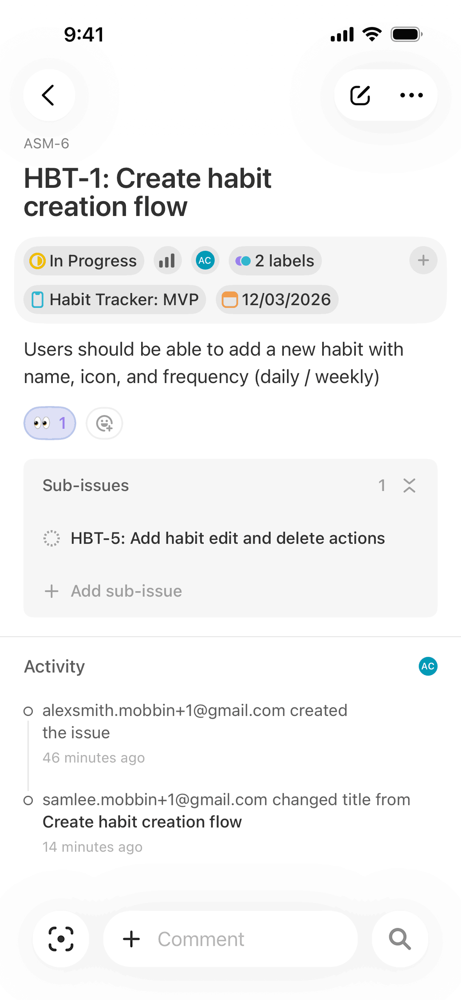
*Linear: Metadata as horizontal pills under the title - the one improvement to steal* - [canonical](https://mobbin.com/screens/ed788cb0-3715-4383-9cbd-783d2a55bdf8)

- **GitHub** - Issue detail: state badge, breadcrumb, author card, markdown body, pinned comment bar: [reference](https://mobbin.com/screens/3f09e921-a039-450a-8d49-b114aa0c20b8) *(citation-only: no public image)*

**Recommended shape:** GitHub's thread anatomy - state badge, events inline, pinned comment bar, metadata behind a bottom sheet - plus Linear's improvement: key metadata as a pill row under the title.

**Pajamas notes:** GitLab labels are Pajamas Label objects; scoped labels (`workflow::in review`) render as two-tone pills - a GitLab-only signature worth designing early. Open is green; closed is neutral or blue, never red.

## Surface 4 - MR view and diff review (the crown jewel)

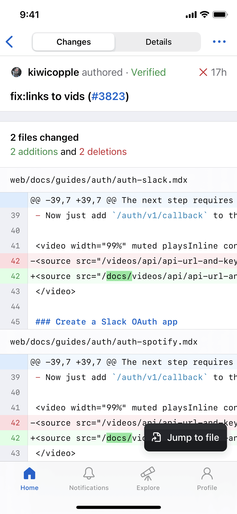
*GitHub: Diff screen: per-file hunks, green/red line backgrounds, "Jump to file"* - [canonical](https://mobbin.com/screens/f078a659-e648-4b5a-b312-f3be58eece15)

- **GitHub** - PR detail flow: branch chips, Reviews and Checks sections, the merge box: [reference](https://mobbin.com/flows/50333781-d95a-4d62-bbd6-5dae42b3a9b7) *(citation-only: no public image)*
- **GitHub** - PR list with filter chips and per-row checks status: [reference](https://mobbin.com/flows/a4054240-3c3c-4a7e-974a-bb4d302211c8) *(citation-only: no public image)*

**Recommended shape:** the anatomy transfers to MRs almost one-to-one - merge box = pipeline status + approvals + mergeability, Checks = Pipelines with GitLab status icons, Reviews = Approvals with required counts. Diff keeps hunk-per-file, Jump to file, line-level comments. Unresolved-discussion count belongs in the merge box, since GitLab blocks merges on unresolved threads.

**Pajamas notes:** the merge button is blue, not GitHub-green. GitLab Mono for all code. Merge-train and auto-merge behind the split-button gear.

## Surface 5 - Code browser

- **GitHub** - Browse code: one directory level per screen, breadcrumb back: [reference](https://mobbin.com/flows/a6b88803-3106-4c47-902d-2b86ec8c3cca) *(citation-only: no public image)*
- **GitHub** - Repository detail as the entry point: [reference](https://mobbin.com/flows/def7a90e-2606-4c80-92a0-d34c8ce78fff) *(citation-only: no public image)*

**Recommended shape:** keep the drill-down list; no side-tree on a phone. File view: syntax highlighting, line numbers, wrap toggle, per-file blame/history action. No strong mobile blame reference exists anywhere - that screen is ours to design fresh.

**Pajamas notes:** add the Pajamas third-party file-type icon collection to file rows; GitLab Mono for content.

## Surface 6 - To-Do inbox and triage

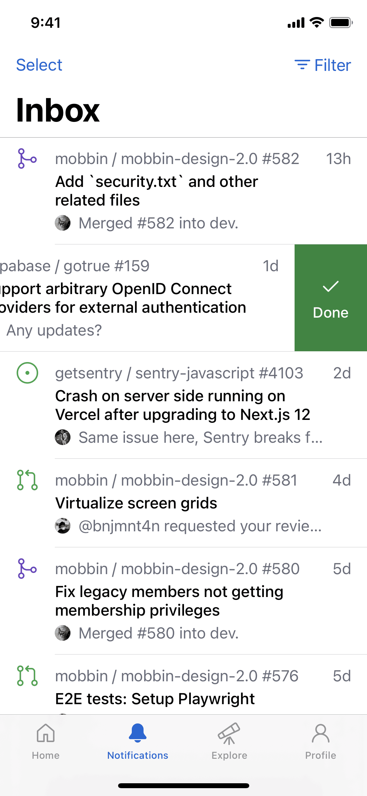
*GitHub: Inbox rows: entity glyph, repo + number, comment preview, swipe-right Done* - [canonical](https://mobbin.com/screens/c52d3c07-2f2f-422d-b9f1-28457b741bf5)

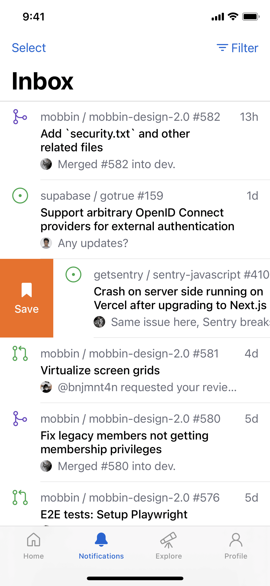
*GitHub: Inbox rows: entity glyph, repo + number, comment preview, swipe-right Done* - [canonical](https://mobbin.com/screens/f53ca970-0d28-4619-89d2-af3d650dc060)

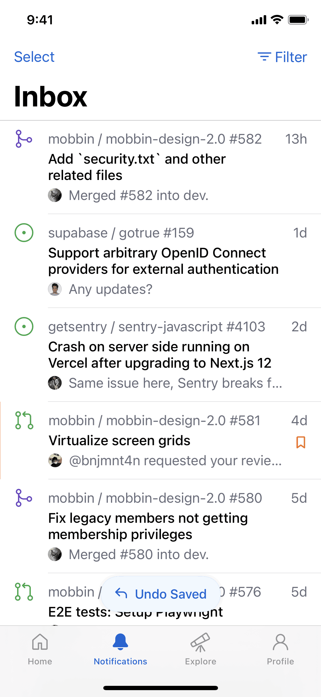
*GitHub: Inbox rows: entity glyph, repo + number, comment preview, swipe-right Done* - [canonical](https://mobbin.com/screens/055f71a7-631f-4231-ace7-47ea501d308c)

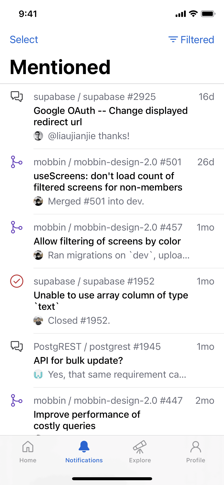
*GitHub: Filtered inbox view ("Mentioned")* - [canonical](https://mobbin.com/screens/5a3306dc-cc3c-4734-bda5-1fdd8dfdba1c)

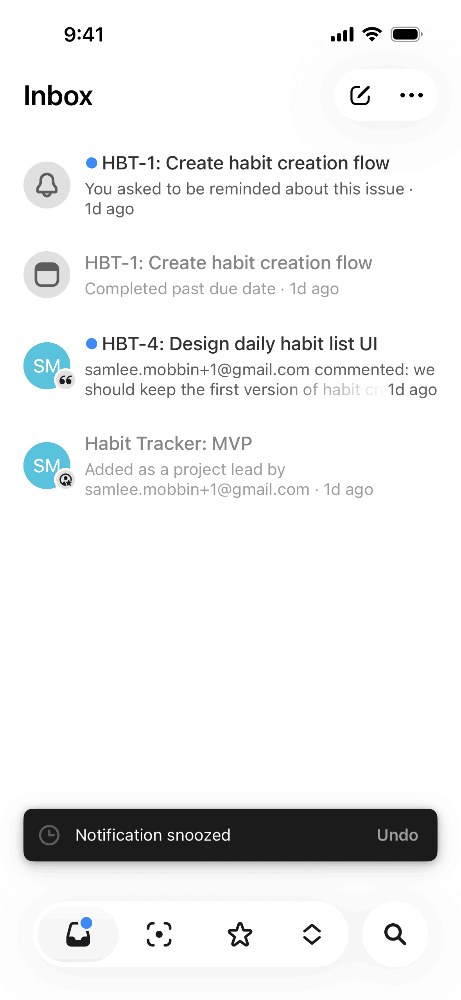
*Linear: Inbox with snooze + undo, filter sheet by type, display options, a designed empty state* - [canonical](https://mobbin.com/screens/3d9ccfd8-2425-49e9-a00b-27189140d3a3)

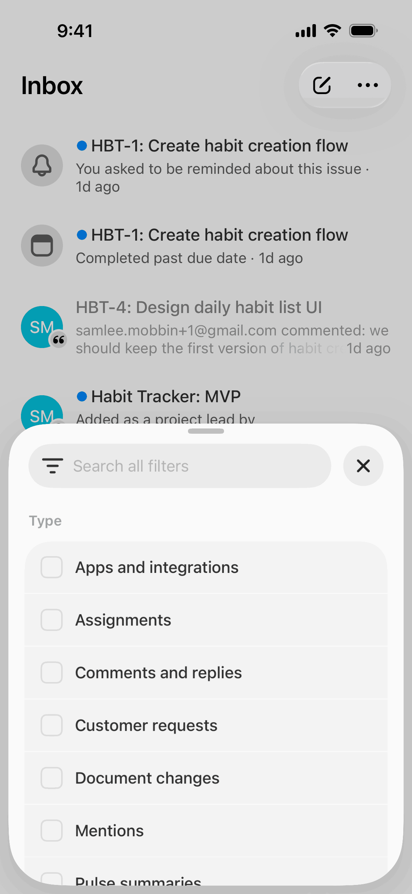
*Linear: Inbox with snooze + undo, filter sheet by type, display options, a designed empty state* - [canonical](https://mobbin.com/screens/2f215b52-9a22-4ee9-b192-88e2de993521)

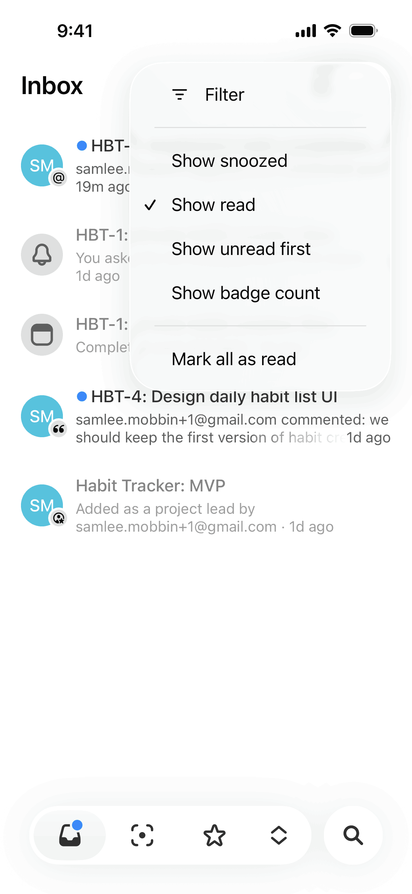
*Linear: Inbox with snooze + undo, filter sheet by type, display options, a designed empty state* - [canonical](https://mobbin.com/screens/f688fc71-2060-49c2-be67-bc6ab5e53bee)

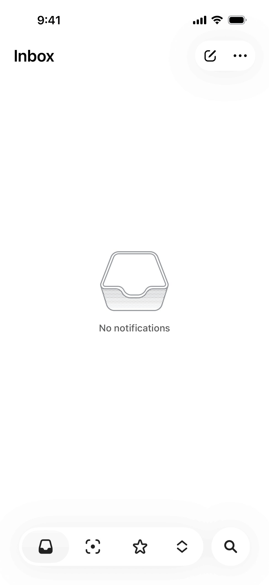
*Linear: Inbox with snooze + undo, filter sheet by type, display options, a designed empty state* - [canonical](https://mobbin.com/screens/6d7c142a-2783-4972-926a-658b4c04f3a1)

**Recommended shape:** To-Do rows in GitHub's anatomy; full-swipe right = Done (green), left = snooze (orange, Linear's verb); undo Toast after every destructive swipe; Linear's filter sheet by to-do reason. GitLab's To-Do List already has a real mark-as-done verb, so swipe-Done maps onto genuine semantics.

**Pajamas notes:** entity glyphs from GitLab SVGs in Pajamas state colors; the empty state is the right place for a purple brand illustration. The layered no-relay notification ruling shapes this surface's expectations copy: near-real-time, honestly not instant.

## Surface 7 - Settings, accounts, and the instance switcher (the other differentiator)

*GitHub: "Add Enterprise Account" hidden in settings - the other anti-pattern* - [canonical](https://mobbin.com/screens/5d3a1ed0-a1b4-4999-892e-e302bc5580a5)

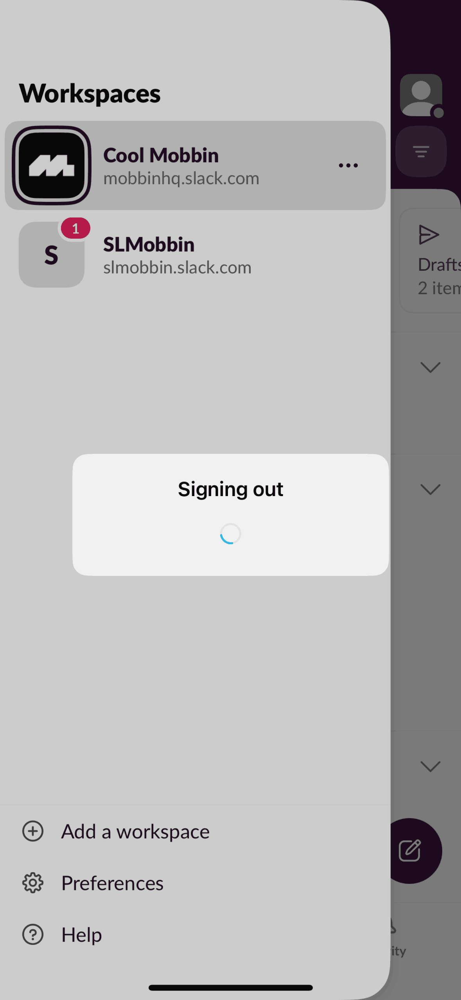
*Slack: Workspace switcher sheet: avatar + name + URL per row, unread badge, add at bottom - the switching shape to steal* - [canonical](https://mobbin.com/screens/e6762d9b-01dc-48bf-99ad-137c8b8bd44a)

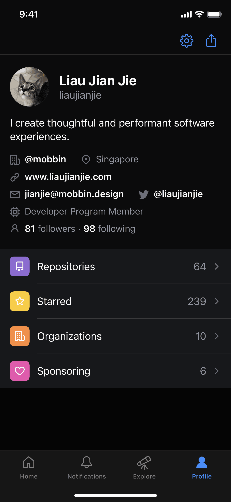
*GitHub: Profile tab and Settings list (Appearance, Code Options, External Links)* - [canonical](https://mobbin.com/screens/5c0bbb27-424b-4830-9184-bdb7e684b85d)

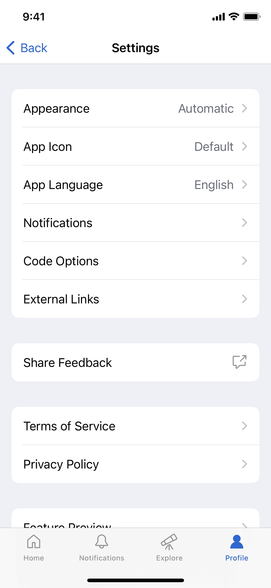
*GitHub: Profile tab and Settings list (Appearance, Code Options, External Links)* - [canonical](https://mobbin.com/screens/02d58dae-2b39-479c-930f-d7e53de1184c)

**Recommended shape:** model accounts as (instance URL, user) pairs, presented Slack-style - the host always visible on every row, because host visibility is the safety feature for multi-instance users. Switcher as a sheet off the Profile avatar; GitHub's Accounts screen stays as management. "Add account" reuses the sign-in surface unchanged.

**Pajamas notes:** Appearance maps light/dark/auto onto the two Pajamas theme applications; design both themes from day one.

## The adjudicated conflicts - where the two languages disagree

| Conflict | GitHub Mobile | Pajamas | Winner and why |
| --- | --- | --- | --- |
| Nouns and copy tone | PR, Checks, playful banners | MR, Pipelines, To-Dos; plain voice | **Pajamas.** The nouns are the product. |
| Merge action color | Green "Squash and Merge" | Blue = action; green = achieved success | **Pajamas:** blue merge button; green reserved for merged/passed states. |
| "Closed" semantics | Red for closed/unplanned | Red strictly critical/error/danger | **Pajamas:** closed = neutral/blue; red only for failures and destructive actions. |
| Icon style | Filled colorful squircle tiles | 1.5px-stroke monochrome, color-inheriting | **Hybrid:** GitHub's tile-with-colored-container on Home, GitLab SVG glyph inside, container color from the ramps. Stroke icons elsewhere. |
| Typeface | System font | GitLab Sans / GitLab Mono | **Pajamas:** bundle both faces. Platform fallback for CJK and accessibility sizes. |
| Instance entry | Enterprise tucked in settings | (no mobile guidance) | **Neither:** Bluesky's instance-field-first sign-in wins. |
| Navigation shell, lists, swipe triage, diff, merge box | Proven patterns | (no mobile guidance) | **GitHub Mobile.** Pajamas governs look, language, semantics; GitHub Mobile governs interaction shapes. |

## Suggested working order

1. **Tokens first:** the five color ramps + neutrals, the two typefaces with the 400/600 pair, the GitLab SVG collections (UI + status + pipeline + file-type).
2. **Frame the seven surfaces in this order:** sign-in, Home, To-Do inbox, MR view, diff, issue view, switcher. Sign-in and the switcher are the differentiators with no precedent to copy.
3. **Light and dark together from day one** - both source systems are dual-theme.
